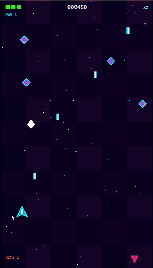

# 🎮 NEON VANGUARD

**Um shoot'em-up retrô 16-bit que roda no navegador — construído orquestrando uma equipe de agentes de IA.**


-1abc9c)

> ▶️ **Jogar agora:** https://alliterhorst.github.io/neon-vanguard/



---

## Sobre

NEON VANGUARD é um jogo de nave vertical, com estética neon 16-bit, que roda direto no navegador: você arrasta a nave, ela atira sozinha, coleta power-ups, enfrenta inimigos variados e um boss com fases.

Ele é, acima de tudo, um **experimento**: a primeira versão jogável (que chamo de **Fase Zero**) de um projeto que investiga como desenvolver jogos de navegador **orquestrando agentes de IA** — cada um com um papel especializado, coordenados por um agente orquestrador.

## Como foi construído (bem rápido)

Em vez de pedir "um jogo pronto", o projeto foi estruturado como um pequeno estúdio: papéis especializados (direção, game design, level design, arte, áudio, balanceamento, QA), um **orquestrador** para coordená-los e um **documento central de decisões** que mantém tudo coerente. A ferramenta de desenvolvimento foi o **Claude** (modelo Opus 4.8).

Decisões técnicas principais:

- **Engine:** Phaser 3 — escolhida por ser popular e bem documentada (o que melhora muito o resultado quando a IA escreve o código).
- **Arte e áudio gerados por código:** sprites desenhados em runtime e efeitos sonoros procedurais estilo *sfxr*; trilha chiptune com Tone.js. Zero assets pagos.
- **Arquitetura data-driven:** inimigos, waves e balanceamento vivem em arquivos de dados, não espalhados pelo código.
- **Qualidade:** 16 testes automatizados de lógica passando e build de produção limpo.

## Tecnologias

`JavaScript (ES Modules)` · `Phaser 3` · `Vite` · `Tone.js` · `Web Audio API` · `Vitest`

## Como jogar

Abra o link acima no navegador. No computador, mova o mouse; no celular, arraste o dedo. O tiro é automático. Bomba: barra de espaço, tecla `X` ou toque secundário.

A versão jogável da raiz (`index.html`) é autocontida — também dá para abri-la localmente com um duplo clique.

## Rodar a versão modular (código-fonte)

O código-fonte organizado em módulos fica em [`app/`](app/):

```bash
cd app
npm install
npm run dev      # abre o jogo em localhost
npm run test     # 16 testes de lógica
npm run build    # build de produção
```

## Status e próximos passos

Esta é a **Fase Zero** — base funcional, testada e jogável. As próximas fases focam em **design**: mais detalhes visuais, novas animações, mecânicas adicionais e ajuste fino de game feel.

Feedback é muito bem-vindo — abra uma issue ou comente nas redes abaixo.

## Autoria

Feito por **Álli Terhorst**.

- LinkedIn: https://www.linkedin.com/in/alliterhorst/
- GitHub: https://github.com/alliterhorst

## Licença

Distribuído sob a licença [MIT](LICENSE).
